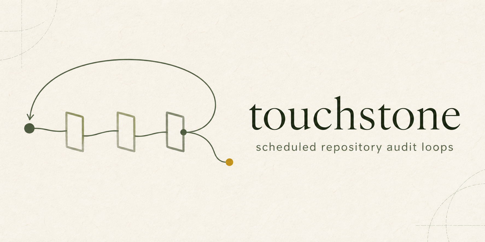
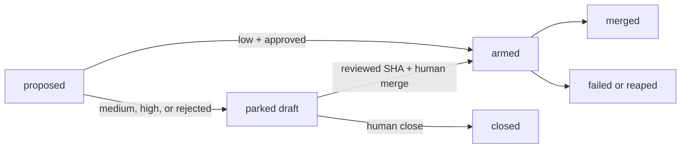

# Touchstone

<div align="center">

<picture>
  <source media="(prefers-color-scheme: dark)" srcset="assets/brand/touchstone-readme-hero-dark.png">
  
</picture>

<br />

**Repository audit loops**

Codex or Claude findings become reviewable GitHub pull requests.

<br />

[PyPI](https://pypi.org/project/touchstone-agent/) · [Install](#getting-started) · [Loop graph](docs/graph.md) · [Example config](touchstone.example.toml) · [Report issue](https://github.com/Misoto22/touchstone/issues)

<br />

[](https://www.python.org/)
[](https://docs.langchain.com/oss/python/langgraph/overview)

</div>

---

### Features

- **Project discovery** (`touchstone init`) — derives the Git root, GitHub slug, and default branch instead of embedding repository values.
- **Preflight diagnostics** (`touchstone doctor`) — checks the engine, GitHub access, workflows, labels, state storage, and native scheduler before a paid session starts.
- **Independent release gate** — only a low-risk change approved by a separate read-only review can be armed for GitHub auto-merge.
- **Park and resume** — medium-, high-, and rejected changes become checkpointed drafts; resume acts only on the reviewed head SHA.
- **Live reconciliation** (`touchstone status`) — projects merged, closed, failed, reaped, armed, and parked pull requests from GitHub truth.
- **Native scheduling** — installs per-user launchd jobs on macOS or systemd timers on Linux from the same portable schedule.

---

### Safety Model

Touchstone does not merge on a model's claim. The author writes a structured finding, deterministic checks can only raise its risk, and a separate read-only session reviews low-risk changes. GitHub auto-merge is considered armed only after GitHub accepts the request.

Malformed or missing agent output is `inconclusive`, never `clean`. Drafts are never automatically reaped. A human resume is refused if the pull-request head differs from the independently reviewed commit.

Repository policy files, Touchstone config, agent instructions, and environment files are always treated as protected. Project config may add more protected paths, but it cannot remove these built-in escalation rules.

> [!IMPORTANT]
> A dry run does not publish to GitHub, but it does run the configured model against a temporary worktree. Use only repositories, hosts, models, and credentials you are authorised to use.

---

### Tech Stack

<table>
<tr><td><b>Runtime</b></td><td>Python 3.12+ · LangGraph 1.0+ · SQLite checkpointer 2.0+</td></tr>
<tr><td><b>Agent engines</b></td><td>Codex CLI · Claude CLI</td></tr>
<tr><td><b>Forge</b></td><td>GitHub CLI · Git worktrees</td></tr>
<tr><td><b>Scheduling</b></td><td>launchd · systemd user timers</td></tr>
<tr><td><b>Quality</b></td><td>pytest 8.0+ · Ruff 0.9+</td></tr>
<tr><td><b>Build</b></td><td>Hatchling</td></tr>
</table>

---

### Project Structure

```
src/touchstone/
├── resources/briefs/       Built-in author and independent-review contracts
├── nodes/                  Audit, classify, review, and graph adapters
├── engines/                Codex and Claude execution contracts
├── execution/              Local and SSH command runners
├── scheduling/             Portable schedules, launchd, and systemd adapters
├── lifecycle.py            Publication, reconciliation, reaping, and resume
├── config.py               Versioned TOML discovery and validation
├── runner.py               Locks, health gates, worktrees, and checkpoints
└── cli.py                  Stable installed command surface
docs/graph.md               Generated graph checked against source
tests/                      Fast, integration, and distribution contracts
touchstone.example.toml     Generic version-1 configuration
```

---

### Getting Started

Install Touchstone, then run the first audited rehearsal inside a GitHub repository that Touchstone may audit:

```bash
pipx install touchstone-agent
cd /path/to/your/repository
touchstone init
touchstone doctor
touchstone setup --dry-run
touchstone setup
touchstone doctor
touchstone run code --dry-run
```

`touchstone init` asks for the engine, model, required default-branch workflow, and schedule. It discovers the repository values and writes `touchstone.toml`; relative paths in that file resolve from the file itself. The first `doctor` run may report missing labels; `setup` creates them, and the second `doctor` verifies the configured repository before any model work starts.

**Prerequisites** — Python 3.12+ · pipx · Git · authenticated GitHub CLI (`gh`) · authenticated Codex CLI or Claude CLI · macOS or Linux for native scheduling

For automation, provide the decisions explicitly:

```bash
touchstone init --non-interactive \
  --engine codex \
  --model YOUR_MODEL_ID \
  --workflow ci.yml \
  --schedule hourly
```

---

### Configuration

Configuration starts with `version = 1`. Unknown keys fail validation. Search order is `--config`, `TOUCHSTONE_CONFIG`, `touchstone.toml` from the current directory to the Git root, `$XDG_CONFIG_HOME/touchstone/config.toml`, then `~/.config/touchstone/config.toml`.

The generated file separates project decisions from credentials:

- `[project]` — target repository path.
- `[forge]` — GitHub slug, default branch, required workflow names, labels, and reap threshold.
- `[engine]` — Codex or Claude, model, effort, timeout, and optional budget.
- `[execution]` — local or SSH execution; remote work and state paths must be absolute.
- `[git]` — optional commit author override; omit it to inherit repository Git configuration.
- `[loop.<name>]` — brief, label, schedule, protected paths, and project context.

See the complete generic [`touchstone.example.toml`](touchstone.example.toml). Built-in briefs use `builtin:code-audit`; custom brief paths resolve relative to the configuration file.

Secrets do not belong in TOML. Secret-shaped SSH environment keys are rejected; GitHub and engine authentication remain in their native CLI stores or the remote runtime environment. When `state_dir` is omitted, Touchstone creates an isolated per-repository directory under `$XDG_STATE_HOME/touchstone` (or `~/.local/state/touchstone`).

---

### Pull-Request Lifecycle



Only `armed`, `parked`, and `merged` suppress the same finding while it is live or complete. Closed, failed, and reaped findings remain in history and may be found again if the defect still exists.

When a run parks, it prints the exact resume command:

```bash
touchstone resume <thread-id> merge
touchstone resume <thread-id> close
```

`resume ... merge` is the operator's attestation that the printed parked head was reviewed. Touchstone reloads the live pull request and refuses the decision if that SHA has changed.

---

### Commands

```
touchstone init                         Discover a repository and write config
touchstone doctor [--json]              Read-only prerequisite checks
touchstone setup [--dry-run]            Create state and configured labels
touchstone run <loop> [--dry-run]       Run one audited iteration
touchstone status [--json]              Reconcile and project lifecycle state
touchstone resume <thread> merge|close  Continue one checkpointed decision
touchstone install-scheduler            Install native user timers
touchstone uninstall-scheduler          Remove native user timers
touchstone scheduler-status [--json]    Inspect scheduler files
touchstone config migrate <path>        Back up and migrate legacy config
touchstone graph                         Print the LangGraph Mermaid source
```

Every config-aware command accepts `--config PATH` before the subcommand.

---

### Scheduling

Each loop accepts one portable local-time schedule:

```
hourly
daily@03:15
weekly@MON,09:30
```

On macOS, Touchstone writes user agents under `~/Library/LaunchAgents`. On Linux, it writes user services and timers under `~/.config/systemd/user`. Generated jobs use the absolute `touchstone` executable, absolute config path, explicit working directory, a credential-free `PATH`, and no credentials. Scheduling remains local to the orchestrator even when repository and model work execute over SSH.

Render scheduler files for review without enabling them:

```bash
touchstone install-scheduler --output ./scheduler-preview
touchstone install-scheduler --dry-run
touchstone install-scheduler
touchstone scheduler-status
```

---

### Troubleshooting

- **A run stops before the model starts** — run `touchstone doctor`; repair every `FAIL`, then review each `WARN` before enabling unattended runs.
- **GitHub preflight fails** — authenticate `gh`, run `touchstone setup`, enable auto-merge, and protect the configured default branch.
- **`production not known good`** — every configured `forge.required_workflows` entry must have an explicit successful run on the default branch.
- **A draft will not resume** — run `touchstone status`; if its head changed, review the new commit rather than approving the old checkpoint.
- **The slot is held** — finish or close the current labelled pull request. Draft-slot behaviour differs by loop scope and is reported by the CLI.
- **A config no longer loads** — run `touchstone config migrate touchstone.toml`; migration writes a sibling backup first.

---

### Security Boundary

Touchstone owns configuration validation, isolated worktrees, model orchestration, deterministic risk gates, checkpoints, lifecycle events, GitHub pull-request transitions, and native timer files.

The target repository owns its tests, branch protection, required checks, deployment verification, audit policy, and credentials. `touchstone setup` creates only the state directory and configured labels; it does not weaken branch protection, create secrets, change Actions permissions, or authenticate tools.

Report vulnerabilities privately through [GitHub Security Advisories](SECURITY.md). Do not include credentials, private repository content, model transcripts, or unredacted `doctor` output in a public issue.

---

### Development

```bash
git clone https://github.com/Misoto22/touchstone.git
cd touchstone
uv sync --extra dev
uv run pytest
uv run ruff check .
uv run ruff format --check src tests
uv run touchstone graph --check
```

See [CONTRIBUTING.md](CONTRIBUTING.md) for the TDD and pull-request workflow. User-facing changes are recorded in [CHANGELOG.md](CHANGELOG.md).

---

### Release

The current release is [v0.1.0](https://github.com/Misoto22/touchstone/releases/tag/v0.1.0), published as [`touchstone-agent` on PyPI](https://pypi.org/project/touchstone-agent/).

GitHub Actions verifies Python 3.12 and 3.13, builds the wheel and source distribution, checks package metadata, and smoke-tests the installed wheel. Publishing is triggered by a GitHub Release and uses PyPI trusted publishing through the protected `pypi` environment; the repository stores no PyPI API token.

---

### Documentation

[`docs/graph.md`](docs/graph.md) is generated from the compiled LangGraph. `touchstone graph --check` keeps the committed diagram aligned with source. The approved architecture and implementation plans live under `docs/superpowers/`.

---

### License

Apache License 2.0. See [LICENSE](LICENSE).
