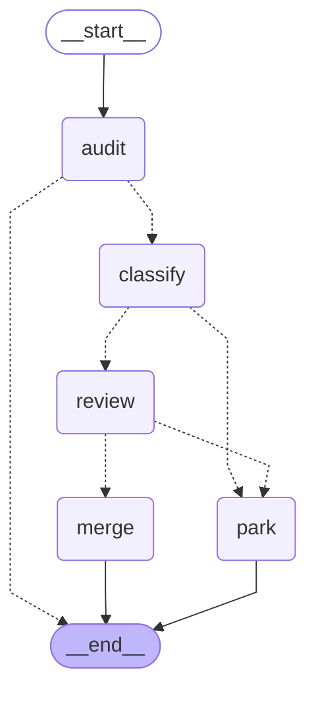

<!-- Generated by `touchstone graph --write`. Do not edit by hand. -->
# The loop, as the code defines it

`park` is an interrupt, not an exit. The thread is checkpointed there and
resumes when a person answers on the pull request.
